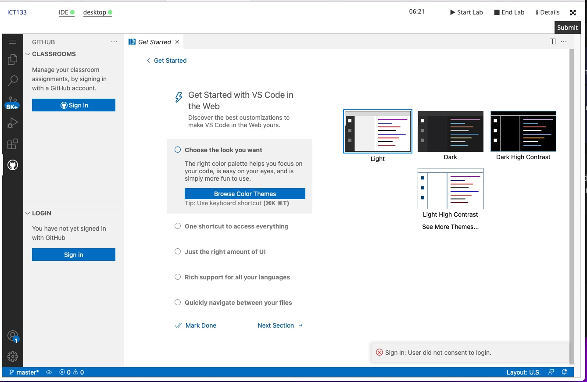

= Github Classroom Workflow

We assume that you have logged into vocareum. If you are looking for instruction to login to vocareum, click here 

== Overview: 

1️⃣ Accept Assignment → 2️⃣ Retrieve Assignment → 3️⃣ Start 

== 1. Accept your assignment on Github 
1. You should receive an email with assignment link in it. The title of the email is __________

2. Click on the email and accept the assignment

3. Once you have accepted the assignment, you are ready to move on step 2.

== 2. Log into Github Classroom & retrieve your assignment on VSCode

NOTE:  Click on the Github tab at the side.

1) Under classroom, click on *sign in*

  

2) Click *allow*

image:3.gif[allow]

3)  

4. 
