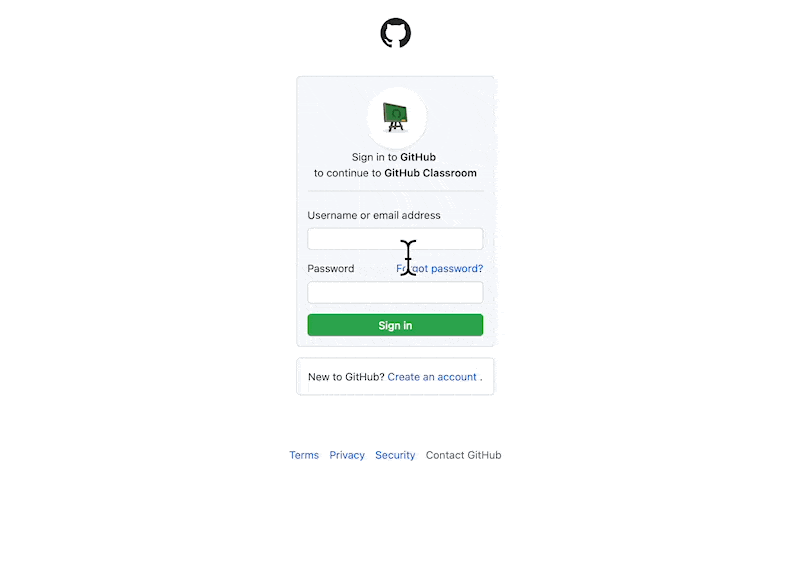
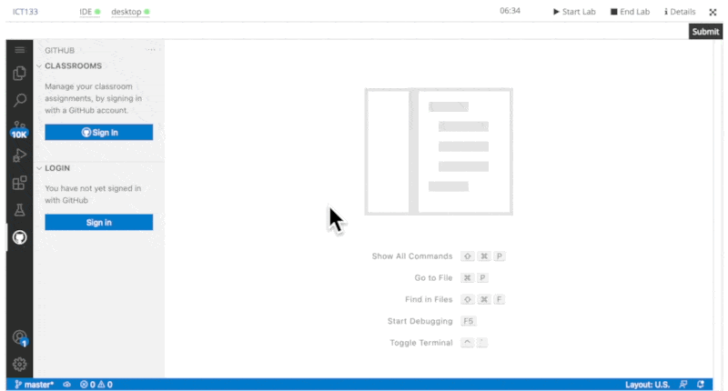

= Github Classroom Workflow

We assume that you have logged into vocareum. If you are looking for instruction to login to vocareum, [line-through]#click here#

== A. Accept your assignment on Github 

  

1) Go to the assignment link that looks like https://classroom.github.com/a/5o4LQE0q

2) Type in your username or email address, follow by Password and click Sign in. 

3) You will be redirected to the assignment 

4) Click *accept this assignment*

5) You will be asked to refresh this page. Go ahead and refresh the page. 

6) You're ready to go! 

== B. Log into Github Classroom & retrieve your assignment on VSCode

  

0) Go to https://labs.vocareum.com/main/main.php[Vocareum] and login using your student username and password.

1) Click on *Sign In* under Classrooms

2) Click on *Allow* when you see the prompt "The extension Github Classroom wants to sign in using Github"

3) Click on *Copy and continue on Github* This will copy the code onto your clipboard.

4) Click on *Open*

5) At the device activation page, paste the code by doing ctrl + v or right click and select paste. Click *continue*

6) Click on *Authorise Vscode*

7) *Login* with your Github credentials

8) Congratulations, you are all set!

== Retrieve the assignment

image:b.gif[b]  

1) Under Classroom, you should see your Github classroom name and the name of the assignment 

2) Click on the folder to open the assignment

3) Your assignment will open up and you can start working on it via Vscode.

