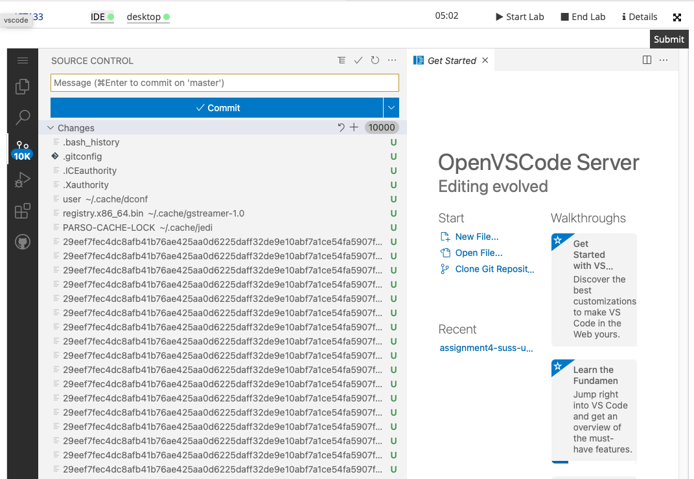
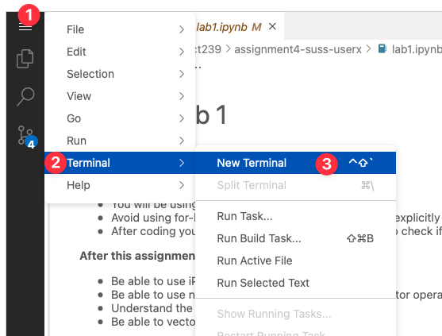

== Many changes to your source control

If you are facing this, 10k changes at source control, this section will teach you how to fix it: 
  

1) Click on the hamburger icon > Select Terminal > Select New Terminal

  

2) With the terminal opened, make sure that you are at the right `pwd`

3) ls `.git` to confirm that the .git is there. This

4) Type `rm -rf .git` and press Enter

5) That's it. 